# Movie Ticket Booking System Flows (Sequence Diagrams)

## 1. Discovery Flow
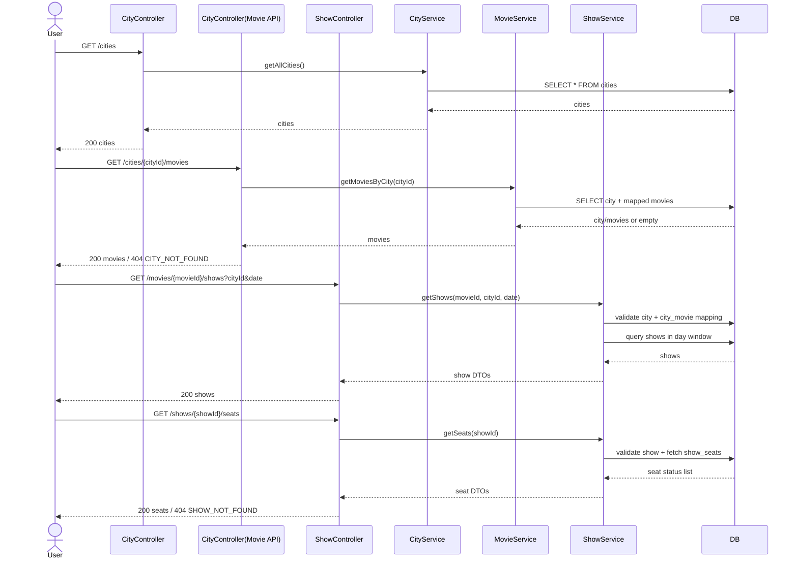

## 2. Admin Setup (City, Theatre, Screen)
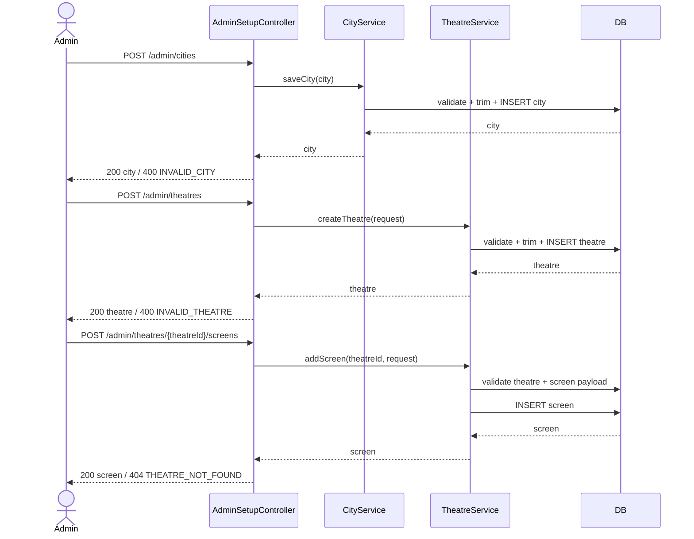

## 3. Admin Show Setup
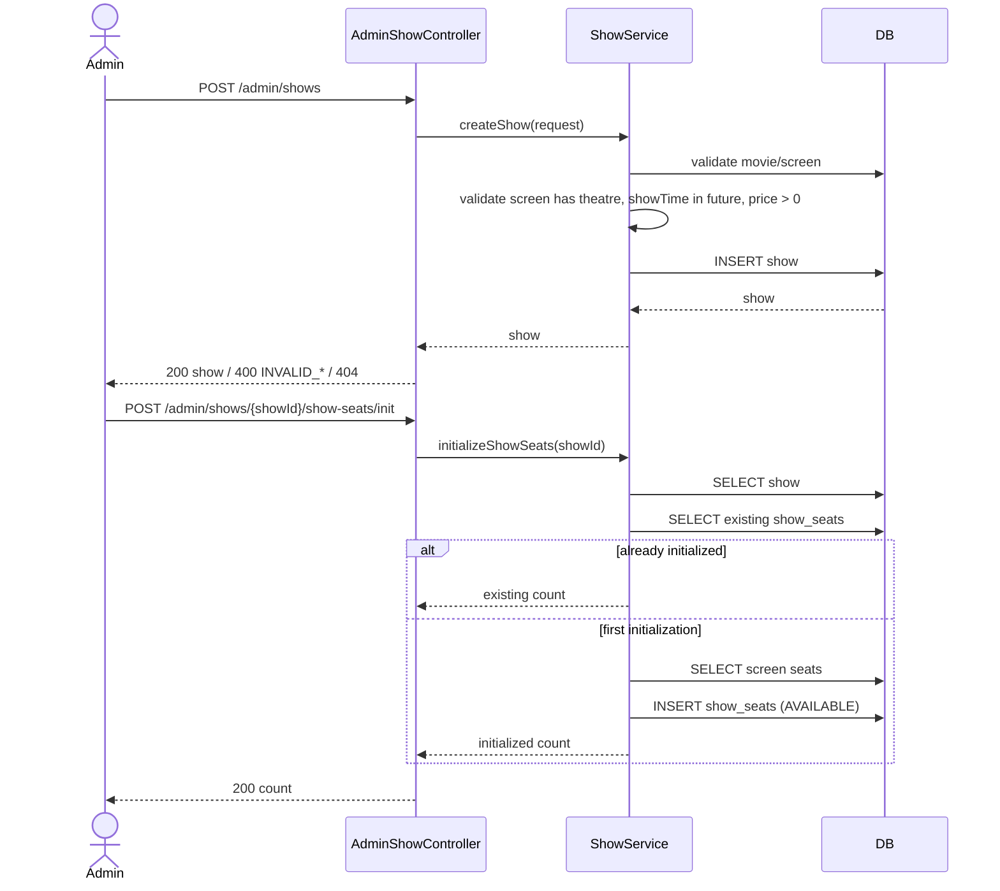

## 4. Seat Hold Flow
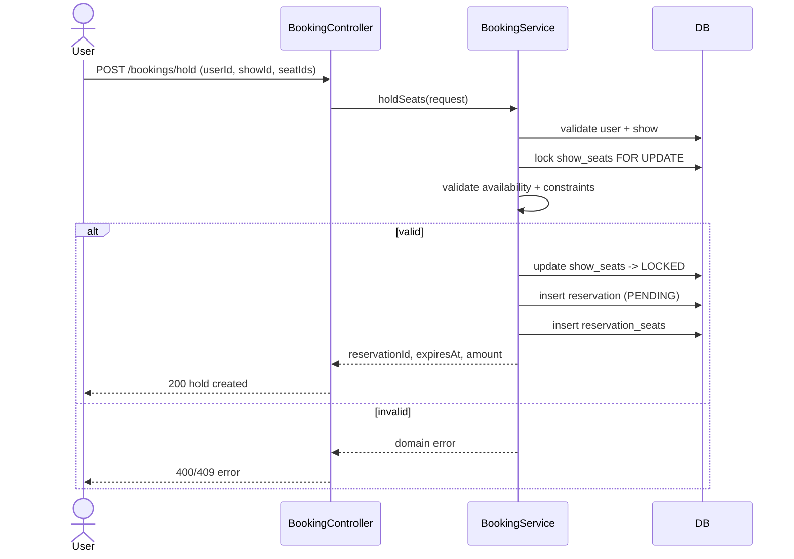

## 5. Payment and Confirmation Flow
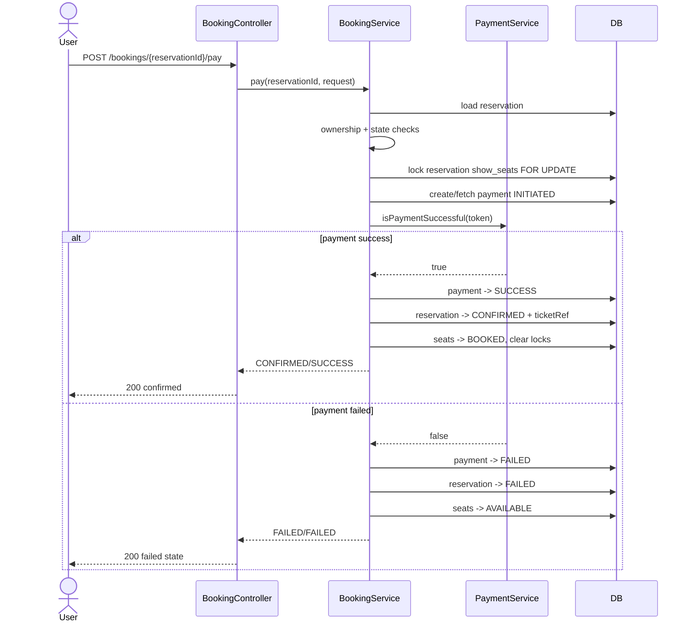

## 6. Booking Retrieval + History
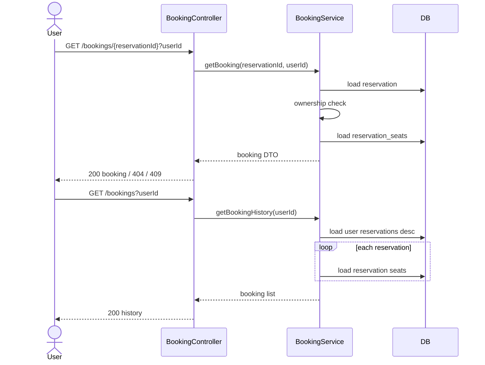

## 7. Cancellation + Refund
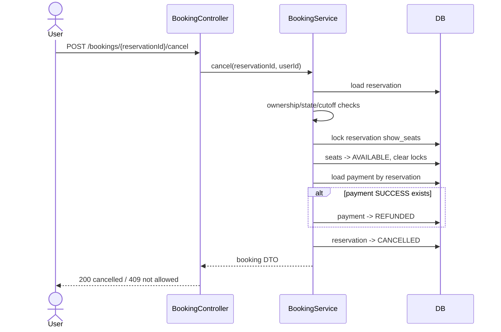

## 8. Lock Expiry Scheduler
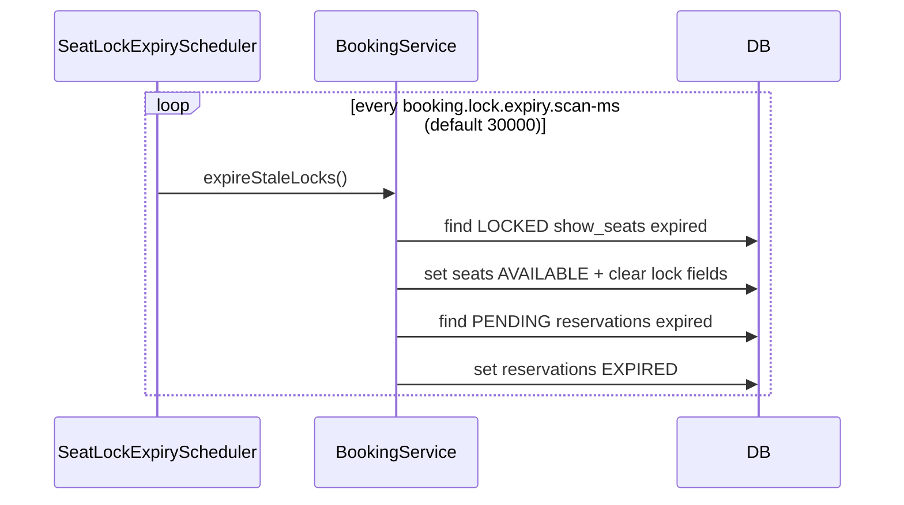

## 9. Reservation State Machine
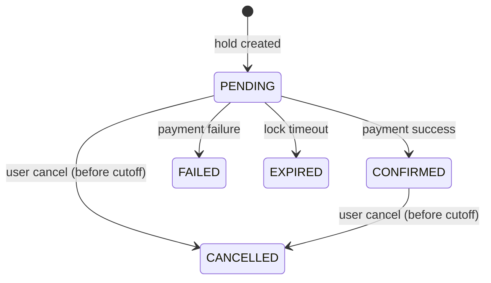

## 10. Payment State Machine
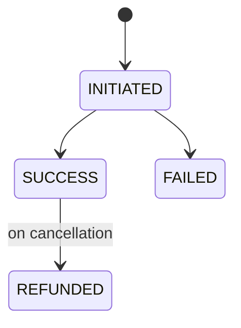

## 11. Show Seat State Machine
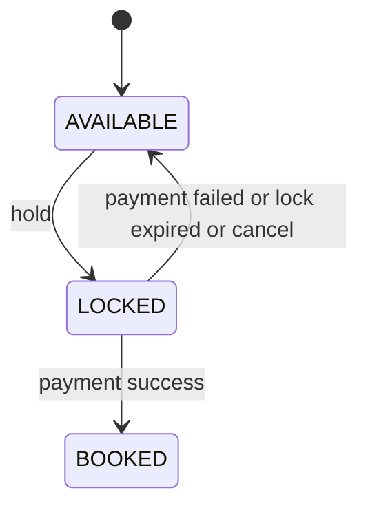
